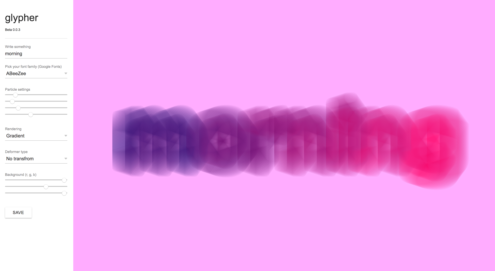
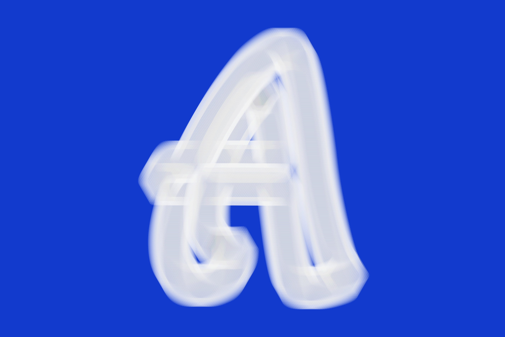

# Create generative graphics based on the shape of letters

> Beta 0.0.4 **glypher** is web-based software to bring you artistic effects based on the shape of all available
letters from the google font api directly in the browser. Have fun, it's for free.

## How it works
- [x] Type any text
- [x] Pick a font-family
- [x] Change colors and strokes
- [x] Save your work as an image

## Running prototye
[https://matthias-jaeger-net.github.io/glypher/app](https://matthias-jaeger-net.github.io/glypher/app)

## App screen

## Examples

# Done
- [x] Set up documents and get started
- [x] Duplicte code from PlayfairRandomSpread project
- [x] Create a very basic user interface
- [x] Added the idea of different types
- [x] Refacture to a glypher class
- [x] Consistent naming for the DOM ids/variables
- [x] Load all google fonts via the api (Seems to work)
- [x] Fix triangle type
- [x] Changed particle type idea to polygon
- [x] Added a custom background color
- [x] Make save button work

# To do
- [ ] Custom fill color and alpha
- [ ] Remove confusion from glypher class
- [ ] Make svg export possible
- [ ] Scaling the radius effect type
- [ ] Single font cut submenu

# Future Ideas - Roadmap
- [ ] Make clickable glyphers
- [ ] Better user interface
- [ ] Add animation types (fLocking, harmonic motion)
- [ ] Try how it works in a WebGL 3D context

# Dependencies

## Rendering
p5*js - a library for rendering graphics in a `<canvas>`
[http://p5js.org/](http://p5js.org/)

## Typography
The Google Font Api provides a large number of font-families as `<option>` in a `<select>`
[https://developers.google.com/fonts/](https://developers.google.com/fonts/)
