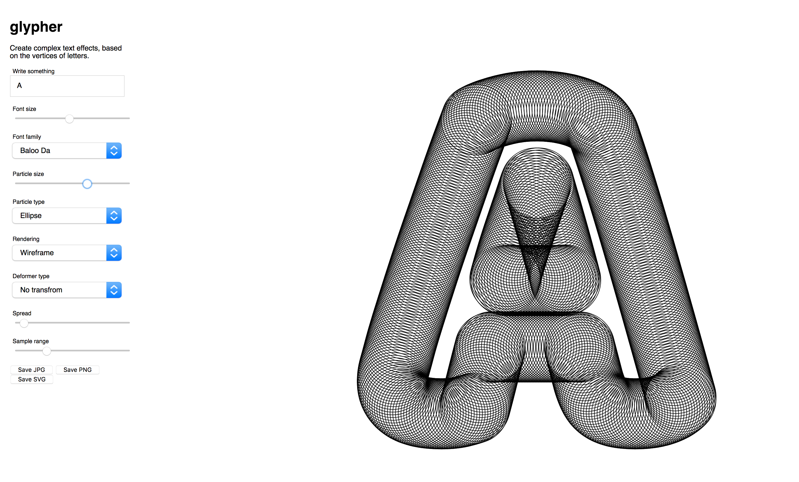
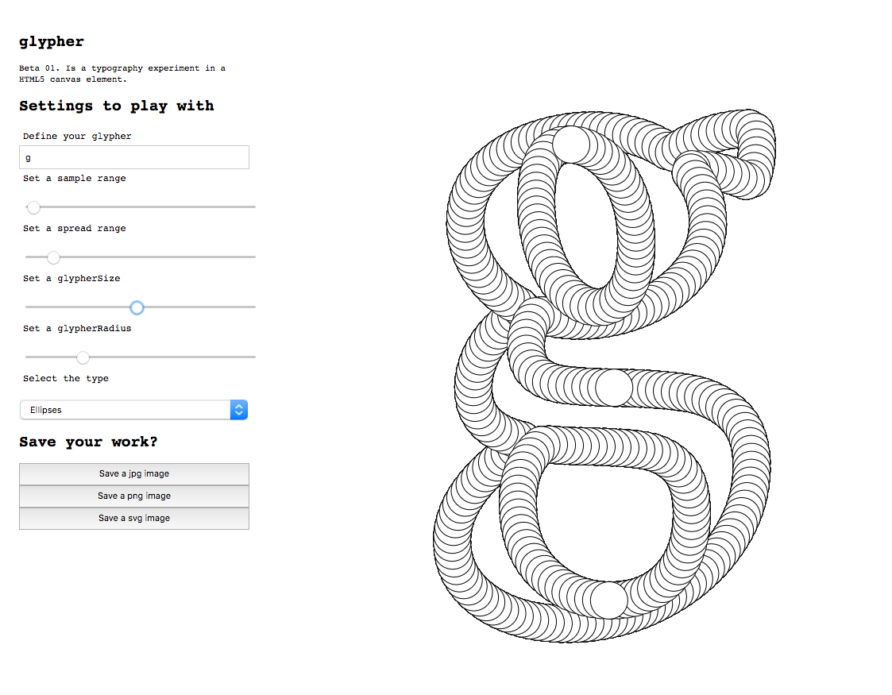

# glypher Beta 0.0.2

glypher is a custom piece of software to bring you
artistic effects based on the shape of all available
letters from the google font api directly in the browser.

## Running prototye
https://matthias-jaeger-net.github.io/glypher/app

## App screen during the development
Current screen

Previous screen on Beta 0.0.1

# Done
- [x] Set up documents and get started
- [x] Duplicte code from PlayfairRandomSpread project
- [x] Create a very basic user interface
- [x] Added the idea of different types
- [x] Refacture to a glypher class
- [x] Consistent naming for the DOM ids/variables
- [x] Load all google fonts via the api (Seems to work)
- [x] Fix triangle type

# To do
- [ ] Remove confusion from glypher class
- [ ] Make save buttons work
- [ ] Make svg export possible
- [ ] Scaling the radius effect type
- [ ] Single font cut submenu
- [ ] Make clickable glyphers
- [ ] Better user interface

# Future Ideas - Roadmap
- [ ] Custom background color
- [ ] Add animation types (fLocking, harmonic motion)
- [ ] Try how it works in a WebGL 3D context

# Dependencies

Rendering in the HTML5 canvas
http://p5js.org/

Google Font Api
https://developers.google.com/fonts/
